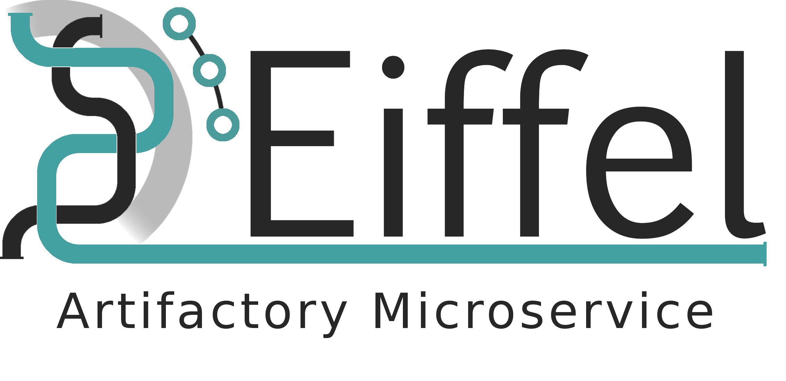

!---
   Copyright 2018 Ericsson AB.
   For a full list of individual contributors, please see the commit history.

   Licensed under the Apache License, Version 2.0 (the "License");
   you may not use this file except in compliance with the License.
   You may obtain a copy of the License at

       http://www.apache.org/licenses/LICENSE-2.0

   Unless required by applicable law or agreed to in writing, software
   distributed under the License is distributed on an "AS IS" BASIS,
   WITHOUT WARRANTIES OR CONDITIONS OF ANY KIND, either express or implied.
   See the License for the specific language governing permissions and
   limitations under the License.
--->



# Eiffelactory: Eiffel Artifactory Microservice
Eiffelactory is a service written in Python that consumes EiffelArtifactCreated
events from a RabbitMQ message bus. The event data is then used to query Artifactory
in order to find the location of the artifact referenced in the EiffelArtifactCreated
event. When an artifact has been found an EiffelArtifactPublished event is generated
and broadcasted on the RabbitMQ message bus.

For more information about Eiffel, see https://github.com/eiffel-community/eiffel.

## How it works

### Consume EiffelArtifactCreatedEvent (ArtC)
*For more information about this event, see the [specification](https://github.com/eiffel-community/eiffel/blob/master/eiffel-vocabulary/EiffelArtifactCreatedEvent.md).*

Eiffelactory can be configured to listen for messages sent to a RabbitMQ message bus.
Once set up, Eiffelactory will listen for all messages sent to a given queue.
The messages are expected to be formatted according to the Eiffel protocol specification.
Users can choose to process all ArtC events or only ArtC events sent from certain sources.

#### Event source filtering
If event source filtering is used, only ArtC events with the corresponding meta.source.name will be processed.
Users can specify event sources in the *eiffelactory.config* file.

#### The data.identity purl
Eiffelactory parses the data.identity [purl](https://github.com/package-url/purl-spec) in an
ArtC event in order to extract information about the created artifact.

*data.identity purl example:*
```
pkg:artifacts/eiffelactory.txt@123?build_path=job/TEST/job/USR/job/PROJECT/123
```

After parsing the purl above `artifact_name` will be *"eiffelactory.txt"* and
`build_path_substring` will be *"job/TEST/job/USR/job/PROJECT/123"*.

Both pieces of information are used to find the location of the artifact.

### Query Artifactory
*For more information about Artifactory, see their [website](https://jfrog.com/artifactory/).*

The data extracted from an ArtC is used to send an [AQL](https://www.jfrog.com/confluence/display/RTF/Artifactory+Query+Language)
query to Artifactory in order find the location of the artifact referenced in the ArtC event.

#### The AQL Query
While users are able to specify a custom AQL query in the *eiffel.config* file, there is little reason to do so at the moment. The only variables available when constructing the AQL query are `artifact_filename` and `build_path_substring`.
It is therefore recommended to use the default AQL query described below.

*Default AQL query:*
```
items.find(
    {{
        "artifact.name":"{artifact_name}",
        "artifact.module.build.url":
            {{"$match":"*{build_path_substring}*"}}
     }}
).include("name","repo","path")
```

The query is populated with `artifact_filename` and `build_path_substring` extracted from
the ArtC data.identity field.

Eiffelactory uses Artifactory's REST API's AQL endpoint at *<artifactory_url>/api/search/aql* to find the location of an artifact.
If the artifact referenced in the ArtC is stored in Artifactory, the response will look like this:
```
{
"results" : [ {
  "repo" : "slask",
  "path" : "eiffelactory",
  "name" : "eiffelactory.txt"
} ],
"range" : {
  "start_pos" : 0,
  "end_pos" : 1,
  "total" : 1
}
}
```
The location of the artifact is formatted by concatenating the Artifactory url with repo, path and name in the response: *<artifactory_url>/slask/eiffelactory/eiffelactory.txt*.
### Broadcast EiffelArtifactPublishedEvent (ArtP)
*For more information about this event, see the [specification](https://github.com/eiffel-community/eiffel/blob/master/eiffel-vocabulary/EiffelArtifactPublishedEvent.md).*

Once the location of the artifact is known, Eiffelactory generates an ArtP event and broadcasts
it to the RabbitMQ exchange configured in *eiffelactory.config*.

*ArtP example:*
```
{
    "data": {
        "locations": [
            {
                "type": "ARTIFACTORY",
                "uri": "https://localhost/artifactory/slask/eiffelactory/eiffelactory.txt"
            }
        ]
    },
    "links": [
        {
            "target": "5de6f82d-52b6-44ae-bdbb-0be4fc213184",
            "type": "ARTIFACT"
        }
    ],
    "meta": {
        "id": "c5486262-0c51-4584-9565-00149cbff165",
        "source": {
            "name": "EIFFELACTORY"
        },
        "time": 1564048029070,
        "type": "EiffelArtifactPublishedEvent",
        "version": "3.0.0"
    }
}
```

## How to run Eiffelactory
In order to run Eiffelactory the *eiffelactory.config* file must be placed in the
*conf* folder.

The easiest way to run the application is to create a virtual environment,
install the dependencies and run main.py.
```bash
$ python3 -m venv venv
$ source venv/bin/activate
$ pip install -r requirements.txt
$ python3 main.py
```

In the repository there are examples of how to deploy Eiffelactory using Dockerfile, docker-compose and Ansible.

## Configuration
### The eiffelactory.config file
Eiffelactory can be configured by placing the *eiffelactory.config* file in the *conf* directory.
The config file contains 3 different sections, one for RabbitMQ options, one for Artifactory
options and one for Eiffelactory options. Users can use *eiffelactory.config.example* as a starting point.

*conf/eiffelactory.config.example:*
```
[rabbitmq]
username = someusername
password = somepassword
host = localhost
port = 15672
vhost = /
exchange = someexchange
exchange_type = topic
routing_key = #
queue = somequeue
prefetch_count = 50

[artifactory]
url = https://localhost:8081/artifactory
username = someusername
password = somepassword
aql_search_string =
    items.find(
        {{
            "artifact.name":"{artifact_name}",
            "artifact.module.build.url":
                {{"$match":"*{build_path_substring}*"}}
         }}
    ).include("name","repo","path")

[eiffelactory]
# used to filter received messages by meta.source.name
# if event_sources is not included, all ArtC events are processed
event_sources = META_SOURCE_NAME, another-source_name
```

Not all keys are mandatory, Eiffelactory will provide default values for the following options:
```
[rabbitmq]
vhost = /
prefetch_count = 50
routing_key = #

[artifactory]
aql_search_string =
    items.find(
        {{
            "artifact.name":"{artifact_name}",
            "artifact.module.build.url":
                {{"$match":"*{build_path_substring}*"}}
         }}
    ).include("name","repo","path")

[eiffelactory]
event_sources = None
```
All other keys must be present otherwise KeyError and configparser.NoOptionError will be raised.

## Running tests
Run all tests:
```bash
$ python -m unittest discover
```

Run all tests corresponding to a specific module:
```bash
$ python -m unittest tests.test_eiffel.TestEiffel
```

Run a single test case:
```bash
$ python -m unittest tests.test_eiffel.TestEiffel.test_create_eiffel_published_event
```

# About this repository
The contents of this repository are licensed under the [Apache License 2.0](./LICENSE).

To get involved, please see [Code of Conduct](./CODE_OF_CONDUCT.md) and [contribution guidelines](./CONTRIBUTING.md).

# About Eiffel
This repository forms part of the Eiffel Community. Eiffel is a protocol for technology agnostic machine-to-machine communication in continuous integration and delivery pipelines, aimed at securing scalability, flexibility and traceability. Eiffel is based on the concept of decentralized real time messaging, both to drive the continuous integration and delivery system and to document it.

Visit [Eiffel Community](https://eiffel-community.github.io) to get started and get involved.

